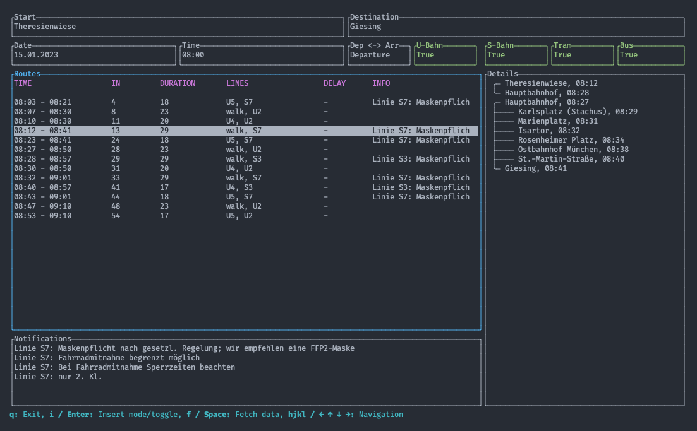

# mvg-tui

Text user interface for services of the Münchner Verkehrsgesellschaft.



## Installation

In the root directory of the project run:

```bash
$ cargo install --path .
```

This installs the mvg-tui command, as long as ~/.cargo is added to your $PATH.

## Usage

You can navigate between the different panes using the arrow keys or `hjkl`.
Input fields can be modified by pressing `enter` or `i`, after modification press
`enter` again or `esc` to go back to navigation mode. The field for specifying 
if the time refers to departure or arrival as well as the fields for defining 
the transportation types can also be toggled with `enter` / `i`.
If your inputs are ready you can fetch the data with `space` or `f`.
When the pane for the table is selected you can select the different results 
and see the corresponding details and notifications for that connection.
